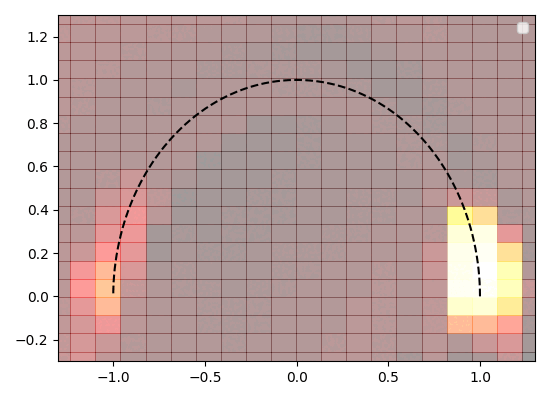

<p align="center"><h1 align='center' class="header-title" style="font-family:'Nunito';"><a href="#">
Meta Reinforcement Learning with Finite Training Tasks - a Density Estimation Approach</a>
</h1> <p align="center">
 <br/> By Zohar Rimon, Aviv Tamar and Gilad Adler <br />
<br /> <a href="https://github.com/zoharri/ReId/issues">Report Bug</a> <br />
</p></p>


This code is based on the open-sourced VariBad repository of Zintgraf et al -
https://github.com/lmzintgraf/varibad.
For general overview of the repository, we refer the reader 
to the original VariBad repository.

#Requirements
The requirements can be found in requirements.txt. One can create a sufficient conda environment with:
```sh
   conda create -n mbrl2 python=3.7
   pip install -r requirements.txt
   ```


# Dream Environments Options
Besides the config options introduces in the VariBad repo, 
1. **env_num_train_goals, env_num_eval_goals** - number of training and evaluation environmnets
2. **num_dream_envs** - number of dream environments processes
3. **use_kde, use_mixup** - use KDE to sample new latents, if false we use the learned Prior
4. **use_mixup** - use the mixup technique to sample new latents instead of regular KDE
5. **delay_dream** - number of iterations to delay the initialization of the dream environments by
6. **update_kde_interval** - iterations interval for the KDE updates
7. **kde_from_train** - create KDE using an oracle policy
8. **kde_from_running_latents** - use a latent pool, gathered along the training for the dream environments estimation
9. **freeze_vae** - don't train the VAE (only the policy)
10. **delayed_freeze** - stop the VAE training after given number of iterations
11. **train_vae_on_dream** - train the VAE to reconstruct reward over the dream environments
12. **clone_dream_vae** - use a different vae for the dream environments

# Reproducing Results
In order to reproduce the experiments shown in the paper:
1. For the 20 real training environments and 4 dream environments experiment:
   ```sh
   python main.py --exp_name 20_train_4_kde_dream --env_type pointrobot_varibad\
                  --env_num_train_goals 20 --num_dream_envs 4
   ```
   
2. For the 30 real training environments and 6 dream environments experiment:
   ```sh
   python main.py --exp_name 30_train_6_kde_dream --env_type pointrobot_varibad \
                  --env_num_train_goals 30 --num_dream_envs 6
   ```

In order to use Mixup dream environments instead of the KDE, add the --use_mixup flag. 

To reproduce the exact figures from the paper one need to run all the seeds specified in utils/plot_helpers.py (for a specific experiment) and run utils/plot_helpers.py.

For example, to reproduce the 30 real training environments experiment (VariBad vs VariBad dream) run seeds:
```python
seeds = [3, 13, 23, 33, 43, 53, 63, 73, 83, 93, 103, 200, 201, 202, 203]
```

# Contact
Zohar Rimon -  zohar.rimon@gmail.com

# Citation

